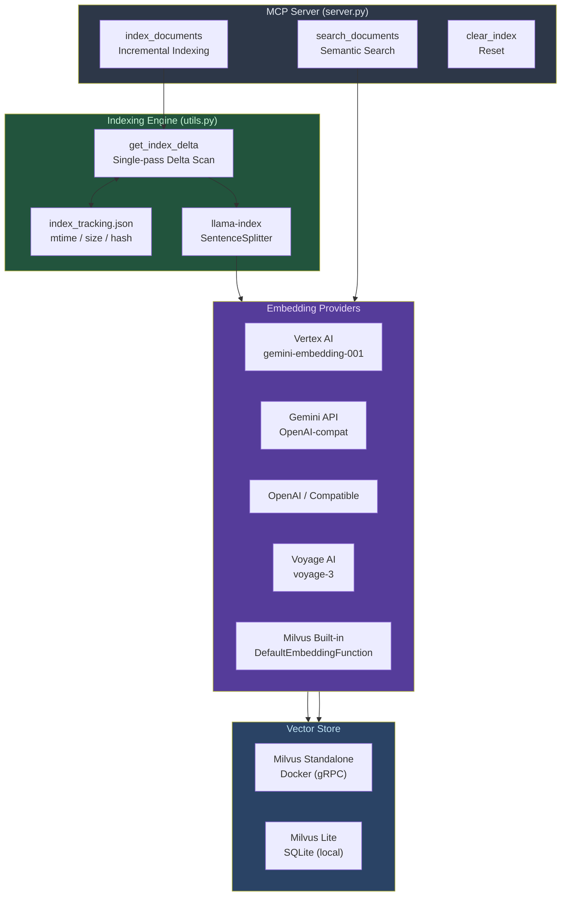
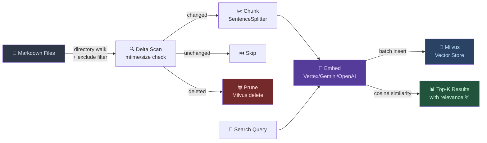
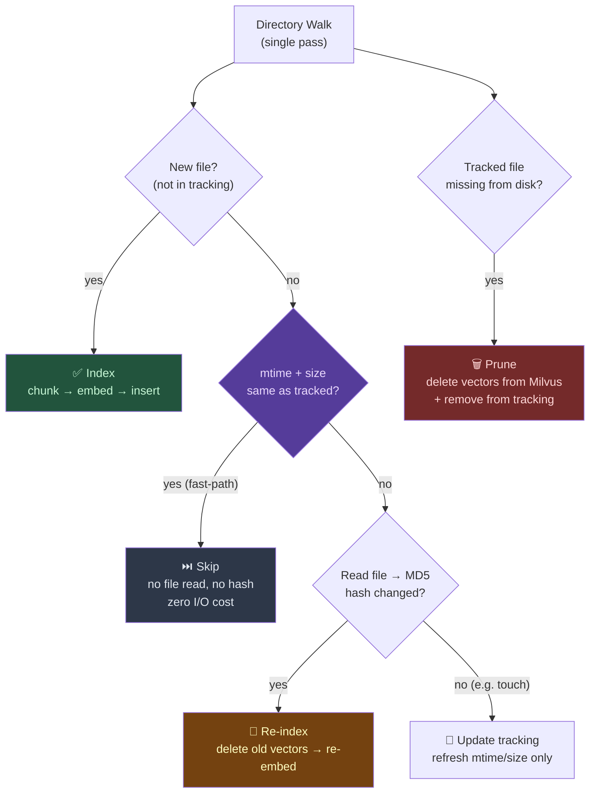

# MCP-Markdown-RAG

[](LICENSE)
[](https://modelcontextprotocol.io)
[](https://python.org/)

A semantic search engine for your markdown documents. An MCP server that indexes notes, docs, and knowledge bases into a Milvus vector database, letting AI assistants find relevant content by **meaning**.

> Ask *"what are the tradeoffs of microservices?"* and find your notes about service boundaries, distributed systems, and API design — even if none of them mention "microservices."

## Features

- **Semantic matching** — finds conceptually related content, not just keyword hits
- **Multi-provider embeddings** — Gemini, OpenAI, Vertex AI, Voyage, or local models
- **Smart incremental indexing** — mtime/size fast-path skips unchanged files without reading them; hash only computed when metadata changes
- **Single-pass delta scan** — detects new, changed, and deleted files in one directory walk
- **Stale vector pruning** — automatically removes vectors for deleted or moved files from Milvus
- **Batch embedding** — concurrent batches with rate-limit retry (429 exponential backoff)
- **Batch insert** — chunked Milvus inserts to stay under the gRPC 64MB message limit
- **Shell reindex CLI** — `reindex.py` for large-scale indexing with real-time progress logs
- **Configurable exclusions** — skip directories (`node_modules`, `.git`, `_legacy`) and files (`AGENTS.md`) via env
- **Milvus Standalone support** — connect to a Docker-based Milvus server for multi-agent concurrent access
- **MCP native** — works with any MCP host (Claude Code, Cursor, Windsurf, VS Code, Antigravity, Codex, etc.)

## Architecture



## How It Works



## Quick Start

Requires [uv](https://docs.astral.sh/uv/) (Python package manager).

### 1. Clone

```bash
git clone https://github.com/bitkyc08-arch/mcp-markdown-rag.git
```

### 2. Configure

Add to your MCP host config:

```json
{
  "mcpServers": {
    "markdown-rag": {
      "command": "uv",
      "args": [
        "--directory", "/path/to/mcp-markdown-rag",
        "run", "server.py"
      ],
      "env": {
        "EMBEDDING_PROVIDER": "gemini",
        "EMBEDDING_MODEL": "gemini-embedding-001",
        "EMBEDDING_DIM": "768",
        "GEMINI_API_KEY": "${GEMINI_API_KEY}",
        "MILVUS_ADDRESS": "http://localhost:19530"
      }
    }
  }
}
```

> **Tip**: For local-only use (no Docker), omit `MILVUS_ADDRESS` — it defaults to a local SQLite-based Milvus Lite file (`.db/milvus_markdown.db`).

## Embedding Providers

| Provider              | `EMBEDDING_PROVIDER` | Default Model            | Auth            |
| --------------------- | -------------------- | ------------------------ | --------------- |
| **Vertex AI**         | `vertex`             | `gemini-embedding-001`   | Service Account |
| **Gemini**            | `gemini`             | `gemini-embedding-001`   | API key         |
| **OpenAI**            | `openai`             | `text-embedding-3-small` | API key         |
| **OpenAI-compatible** | `openai-compatible`  | `text-embedding-3-small` | API key         |
| **Voyage**            | `voyage`             | `voyage-3`               | API key         |
| **Local**             | `local`              | Milvus built-in (768d)   | —               |

<details>
<summary><strong>Vertex AI</strong> — Google Cloud 프로덕션 권장</summary>

Google Cloud의 Vertex AI를 통해 `gemini-embedding-001` 모델을 사용합니다. API key 대신 **Service Account 인증**을 사용하며, OAuth 토큰이 자동 갱신됩니다. 프로덕션 환경에서 가장 안정적입니다.

**장점**: 높은 Rate Limit, 자동 토큰 갱신, GCP 프로젝트 단위 빌링
**단점**: GCP 프로젝트 + Service Account 설정 필요

**사전 준비**:
1. GCP 프로젝트 생성 & Vertex AI API 활성화
2. Service Account 생성 → JSON 키 다운로드
3. `Vertex AI User` 역할 부여

```json
{
  "EMBEDDING_PROVIDER": "vertex",
  "EMBEDDING_MODEL": "gemini-embedding-001",
  "EMBEDDING_DIM": "768",
  "GOOGLE_APPLICATION_CREDENTIALS": "/path/to/service-account.json",
  "VERTEX_PROJECT": "your-gcp-project-id",
  "VERTEX_LOCATION": "us-central1"
}
```

**참고**: `VERTEX_LOCATION`은 모델 사용 가능 리전에 맞춰야 합니다. `gemini-embedding-001`은 `us-central1`에서 사용 가능. 전체 리전 목록은 [Vertex AI 문서](https://cloud.google.com/vertex-ai/docs/general/locations)를 참고.

</details>

<details>
<summary><strong>Gemini</strong> — 빠른 시작에 가장 쉬움</summary>

Google AI Studio의 Gemini API를 사용합니다. API key 하나면 바로 사용 가능해서 가장 간단합니다. 내부적으로 OpenAI-compatible 엔드포인트(`generativelanguage.googleapis.com/v1beta/openai/`)를 사용합니다.

**장점**: 가입 후 즉시 사용, 무료 Tier 있음
**단점**: Rate Limit이 Vertex 대비 낮음 (분당 1,500 RPM 기본)

**사전 준비**:
1. [Google AI Studio](https://aistudio.google.com/)에서 API key 발급

```json
{
  "EMBEDDING_PROVIDER": "gemini",
  "EMBEDDING_MODEL": "gemini-embedding-001",
  "EMBEDDING_DIM": "768",
  "GEMINI_API_KEY": "your-api-key"
}
```

**참고**: 대량 인덱싱(1000+ 파일) 시 429 에러가 발생할 수 있습니다. `EMBEDDING_BATCH_DELAY_MS=1000`으로 설정하면 안정적입니다.

</details>

<details>
<summary><strong>OpenAI</strong> — text-embedding-3 시리즈</summary>

OpenAI의 임베딩 API를 사용합니다. `text-embedding-3-small` (1536d)과 `text-embedding-3-large` (3072d) 모델을 지원합니다. `EMBEDDING_DIM`으로 차원을 줄일 수 있습니다 (Matryoshka representation).

**장점**: 높은 품질, 차원 축소 지원
**단점**: 유료 (small: $0.02/1M tokens, large: $0.13/1M tokens)

**사전 준비**:
1. [OpenAI Platform](https://platform.openai.com/)에서 API key 발급

```json
{
  "EMBEDDING_PROVIDER": "openai",
  "EMBEDDING_MODEL": "text-embedding-3-small",
  "EMBEDDING_DIM": "768",
  "OPENAI_API_KEY": "sk-..."
}
```

**참고**: `EMBEDDING_DIM`을 768로 설정하면 원래 1536d 벡터를 768d로 줄여서 저장합니다. 검색 품질은 소폭 감소하지만 스토리지와 속도가 개선됩니다.

</details>

<details>
<summary><strong>OpenAI-compatible</strong> — 자체 호스팅 / 써드파티 API</summary>

OpenAI API 형식을 따르는 모든 임베딩 서비스에 연결합니다. Ollama, LM Studio, Azure OpenAI, Together AI, Fireworks AI 등 다양한 서비스와 호환됩니다.

**장점**: 자체 호스팅 모델 사용 가능, 프라이버시 보장
**단점**: 서비스별 설정이 다를 수 있음

```json
{
  "EMBEDDING_PROVIDER": "openai-compatible",
  "EMBEDDING_MODEL": "nomic-embed-text",
  "EMBEDDING_DIM": "768",
  "EMBEDDING_API_KEY": "your-api-key-or-dummy",
  "EMBEDDING_BASE_URL": "http://localhost:11434/v1"
}
```

**Ollama 예시**: Ollama에서 `nomic-embed-text`를 사용하려면:

```bash
ollama pull nomic-embed-text
# EMBEDDING_BASE_URL=http://localhost:11434/v1
# EMBEDDING_API_KEY=ollama  (아무 값이나 OK)
```

**Azure OpenAI 예시**:

```json
{
  "EMBEDDING_BASE_URL": "https://your-resource.openai.azure.com/openai/deployments/your-deployment",
  "EMBEDDING_API_KEY": "your-azure-api-key"
}
```

</details>

<details>
<summary><strong>Voyage</strong> — Retrieval 특화 임베딩</summary>

Voyage AI의 임베딩 모델을 사용합니다. `voyage-3`은 검색(retrieval) 태스크에 최적화되어 있어서 RAG에 특히 적합합니다. Anthropic이 Claude에 사용하는 임베딩 provider로도 알려져 있습니다.

**장점**: RAG/검색 품질 최상위권, 긴 컨텍스트 지원 (최대 32K tokens)
**단점**: 유료 ($0.06/1M tokens), 무료 Tier 제한적

**사전 준비**:
1. [Voyage AI](https://www.voyageai.com/)에서 API key 발급

```json
{
  "EMBEDDING_PROVIDER": "voyage",
  "EMBEDDING_MODEL": "voyage-3",
  "VOYAGE_API_KEY": "pa-..."
}
```

**사용 가능 모델**:

| 모델            | 차원 | 최대 토큰 | 용도        |
| --------------- | ---- | --------- | ----------- |
| `voyage-3`      | 1024 | 32K       | 범용 (권장) |
| `voyage-3-lite` | 512  | 32K       | 경량/저비용 |
| `voyage-code-3` | 1024 | 32K       | 코드 특화   |

**참고**: `EMBEDDING_DIM`을 별도 설정하지 않아도 됩니다. Voyage는 모델별 고정 차원을 사용합니다.

</details>

<details>
<summary><strong>Local</strong> — 오프라인 / 무료</summary>

Milvus에 내장된 기본 임베딩 함수를 사용합니다 (`DefaultEmbeddingFunction`, 768d). 인터넷 연결이나 API key 없이 완전한 로컬 환경에서 동작합니다.

**장점**: 무료, 오프라인 사용, API 의존성 없음
**단점**: 클라우드 모델 대비 검색 품질 낮음, 첫 실행 시 모델 다운로드에 시간 소요

```json
{
  "EMBEDDING_PROVIDER": "local"
}
```

별도 환경변수 설정이 필요 없습니다. `EMBEDDING_PROVIDER`를 생략해도 기본값이 `local`입니다. 테스트나 프로토타이핑에 적합합니다.

</details>

## Tools

| Tool               | Description                                                                                                                             |
| ------------------ | --------------------------------------------------------------------------------------------------------------------------------------- |
| `index_documents`  | Index markdown files with incremental updates. Automatically detects new, changed, and deleted files. Prunes stale vectors from Milvus. |
| `search_documents` | Semantic search across indexed documents. Returns top-k results with relevance scores and file paths.                                   |
| `clear_index`      | Reset the vector database and tracking state.                                                                                           |

## Incremental Indexing & Pruning

The indexing engine uses a **single-pass delta scan** (`get_index_delta()`) to efficiently detect new, changed, and deleted files in one directory walk — no separate passes needed.



### Optimization Techniques

<details>
<summary><strong>1. mtime/size Fast-Path</strong> — 파일을 읽지 않고 변경 여부 판단</summary>

전통적인 증분 인덱싱은 모든 파일을 열어서 해시를 계산합니다. 1300개 파일이면 1300번 파일 I/O가 발생합니다.

이 서버는 `os.stat()` 시스템콜로 **mtime(수정 시각)과 size(파일 크기)만 먼저 확인**합니다. 이 두 값이 tracking과 동일하면 내용이 바뀌지 않았다고 판단하고 **파일을 아예 열지 않습니다**.

```python
# Fast path: 파일을 읽지 않고 메타데이터만 비교
file_stat = os.stat(file_path)  # 시스템콜 1회 (ns 단위)
if stored_mtime == file_stat.st_mtime and stored_size == file_stat.st_size:
    continue  # 파일 읽기 0회, 해시 계산 0회
```

**효과**: 1300개 파일 스캔 시 해시 계산 0회 → 전체 스캔이 수 밀리초에 완료.

</details>

<details>
<summary><strong>2. Single-Pass Delta Scan</strong> — 변경 + 삭제를 한 번에 감지</summary>

기존 구현은 두 번의 스캔이 필요했습니다:
- Pass 1: `get_changed_files()` — 디렉토리를 순회하며 변경된 파일 찾기
- Pass 2: `get_deleted_files()` — tracking 데이터를 순회하며 삭제된 파일 찾기

이것을 `get_index_delta()`로 통합하여 **한 번의 디렉토리 순회**로 변경과 삭제를 동시에 감지합니다.

```python
def get_index_delta(directory, recursive=False) -> tuple[list[str], list[str]]:
    md_files = list_md_files(directory, recursive)
    current_files_set = set(md_files)

    # Pass 1 of 1: 삭제 감지 (tracking에 있지만 디스크에 없는 파일)
    for tracked_path in list(tracking_data.keys()):
        if tracked_path not in current_files_set:
            deleted_files.append(tracked_path)

    # Pass 1 of 1 (계속): 변경 감지 (mtime/size fast-path → hash fallback)
    for file_path in md_files:
        # ... mtime/size 비교 → hash 비교
    
    return changed_files, deleted_files  # 한 번에 반환
```

**효과**: 2-pass → 1-pass로 디렉토리 순회 횟수 절반. 벤치마크 기준 **2.28x 속도 개선**.

</details>

<details>
<summary><strong>3. Tracking Format 확장</strong> — 하위호환 유지하면서 size 추가</summary>

tracking 파일 (`index_tracking.json`)의 포맷을 확장하여 파일 크기 정보를 추가했습니다.

```
Before: [hash, mtime]            ← 기존 포맷
After:  [hash, mtime, size]      ← 확장 포맷
```

`_parse_tracking_entry()` 파서가 두 포맷 모두 읽을 수 있어서 **기존 데이터를 마이그레이션하지 않아도 됩니다**. 다음 스캔 시 자동으로 size가 추가됩니다.

</details>

<details>
<summary><strong>4. Batch Embedding + Rate Limit Retry</strong> — 대량 임베딩 안정성</summary>

임베딩 API에 수천 개의 텍스트를 보낼 때 발생하는 문제들을 처리합니다:

| 문제                        | 해결                                                        |
| --------------------------- | ----------------------------------------------------------- |
| API 429 (Too Many Requests) | Exponential backoff 재시도 (5s → 10s → 20s → 40s, 최대 5회) |
| gRPC 64MB 메시지 초과       | `MILVUS_INSERT_BATCH=5000`으로 분할 insert                  |
| 대량 요청 시 메모리         | `EMBEDDING_BATCH_SIZE=100`으로 마이크로 배치                |
| API 간 딜레이               | `EMBEDDING_BATCH_DELAY_MS=1000`으로 조절                    |

</details>

### Performance

| Metric                                | Result                              |
| ------------------------------------- | ----------------------------------- |
| Unchanged files — hash computations   | **0** (mtime/size fast-path)        |
| Changed file — embed + insert         | **~3 seconds**                      |
| No changes — full scan                | **instant** ("Already up to date!") |
| Deleted file — prune + scan           | **instant**                         |
| Full reindex (1300 files, 23K chunks) | **~7–8 minutes**                    |
| 1-pass vs 2-pass scan time            | **2.28x faster**                    |

### How Pruning Works

When a file is deleted or moved to an excluded directory (e.g. `_legacy/`), the next incremental `index_documents` call will:

1. Detect the file is missing from the current directory scan
2. Delete its vectors from Milvus (`filter: path == '...'`)
3. Remove it from the tracking file
4. Return a message: `"Pruned N deleted/moved files."`

No manual cleanup needed — just delete the file and re-index.

## Shell Reindex CLI

### MCP vs Shell — 언제 무엇을 쓰나?

| 상황                             | MCP `index_documents` | Shell `reindex.py` |
| -------------------------------- | :-------------------: | :----------------: |
| 파일 몇 개 변경 후 증분 업데이트 |           ✅           |                    |
| 1000+ 파일 전체 재인덱싱         |                       |         ✅          |
| 모노레포 / 대규모 코드베이스     |                       |         ✅          |
| 429/gRPC 에러 디버깅 필요        |                       |         ✅          |
| 실시간 진행률 로그 확인          |                       |         ✅          |
| AI 에이전트가 자동으로 실행      |           ✅           |                    |

MCP 도구(`index_documents`)는 **최종 결과만 반환**하기 때문에 실시간 로그를 볼 수 없고, 대량 인덱싱 시 타임아웃 위험이 있습니다. `reindex.py`는 shell에서 직접 실행하여 배치 진행률, 에러, 소요 시간을 실시간으로 확인할 수 있습니다.

### Usage

```bash
cd /path/to/mcp-markdown-rag

# Incremental (changed + deleted files only)
EMBEDDING_PROVIDER=vertex \
MILVUS_ADDRESS=http://localhost:19530 \
GOOGLE_APPLICATION_CREDENTIALS=/path/to/sa.json \
VERTEX_PROJECT=your-project-id \
VERTEX_LOCATION=us-central1 \
uv run python reindex.py /path/to/vault

# Full rebuild (⚠️ drops and re-creates collection)
uv run python reindex.py /path/to/vault --force

# Non-recursive (top-level files only)
uv run python reindex.py /path/to/vault --no-recursive
```

### Shell Reindex Features

| Feature             | Description                                                            |
| ------------------- | ---------------------------------------------------------------------- |
| Real-time progress  | `Batch 72/119 — elapsed 4m32s`                                         |
| 429 retry           | Exponential backoff (5s, 10s, 20s, 40s, 80s) × 5 attempts              |
| Insert batching     | `MILVUS_INSERT_BATCH=5000` chunks per gRPC call                        |
| Incremental + prune | Same `get_index_delta()` as MCP — detects changes AND deletions        |
| `--force`           | Drop collection → full re-embed (use for schema changes or corruption) |

<details>
<summary><strong>Mono-repo / Large Codebase Guide</strong></summary>

모노레포나 대규모 문서 볼트(1000+ 파일)에서는 MCP 대신 shell reindex를 사용하세요.

**첫 인덱싱 (전체)**:
```bash
# 전체 볼트를 한 번에 인덱싱 (약 7-8분)
uv run python reindex.py /path/to/monorepo --force
```

**이후 일상 업데이트**:
```bash
# 변경된 파일만 증분 인덱싱 (수 초)
uv run python reindex.py /path/to/monorepo
```

**디렉토리 제외**:
```bash
# 특정 디렉토리 제외 (env로 설정)
MARKDOWN_EXCLUDE_DIRS="_legacy,archive,vendor" \
uv run python reindex.py /path/to/monorepo
```

**Rate limit 보수적 설정** (Vertex AI 무료 Tier 등):
```bash
EMBEDDING_BATCH_SIZE=50 \
EMBEDDING_BATCH_DELAY_MS=2000 \
EMBEDDING_CONCURRENT_BATCHES=2 \
uv run python reindex.py /path/to/vault --force
```

</details>

<details>
<summary><strong>RAG Skill Reference</strong> — AI 에이전트용 권장 워크플로우</summary>

AI 에이전트(Claude Code, Antigravity, Codex 등)가 이 서버를 사용할 때의 권장 워크플로우입니다. `.agents/skills/rag/SKILL.md`에서 발췌:

**Document RAG Flow**:
```
index_documents(directory, recursive=true) → search_documents(query, k)
```

**When to use Shell vs MCP**:
- MCP: 소규모 증분 업데이트 (일상적 사용)
- Shell: 전체 리인덱싱 (`--force`), 1000+ 파일 대량 업데이트, 에러 디버깅

**Query Language Policy**:
- Code RAG → English queries
- Document RAG → User's language (e.g. Korean)

**Destructive Operations (주의)**:
- `index_documents(force_reindex=true)` — 컬렉션 drop 후 재생성
- `clear_index` — 전체 벡터 + tracking 삭제
- 사용자가 명시적으로 요청할 때만 실행

</details>

## Configuration

### Core

| Variable             | Default                  | Description                                                          |
| -------------------- | ------------------------ | -------------------------------------------------------------------- |
| `EMBEDDING_PROVIDER` | `local`                  | `gemini`, `openai`, `openai-compatible`, `vertex`, `voyage`, `local` |
| `EMBEDDING_MODEL`    | (provider default)       | Model name override                                                  |
| `EMBEDDING_DIM`      | `768`                    | Vector dimension                                                     |
| `MILVUS_ADDRESS`     | `.db/milvus_markdown.db` | Milvus address (`http://host:port`) or local file path               |

### Indexing Tuning

| Variable                       | Default | Description                                                                |
| ------------------------------ | ------- | -------------------------------------------------------------------------- |
| `MARKDOWN_CHUNK_SIZE`          | `2048`  | Token chunk size for splitting documents                                   |
| `MARKDOWN_CHUNK_OVERLAP`       | `100`   | Token overlap between chunks                                               |
| `EMBEDDING_BATCH_SIZE`         | `250`   | Texts per embedding API call                                               |
| `EMBEDDING_BATCH_DELAY_MS`     | `0`     | Delay between embedding batches (ms). Set to `1000` for rate-limited APIs. |
| `EMBEDDING_CONCURRENT_BATCHES` | `4`     | Parallel embedding batches                                                 |
| `MILVUS_INSERT_BATCH`          | `5000`  | Rows per Milvus insert call (gRPC 64MB limit)                              |

### Exclusions

| Variable                 | Default | Description                                                                                                                                    |
| ------------------------ | ------- | ---------------------------------------------------------------------------------------------------------------------------------------------- |
| `MARKDOWN_EXCLUDE_DIRS`  | —       | Extra directories to exclude (comma-separated). Added to built-in: `node_modules`, `__pycache__`, `devlog`, `_legacy`, `dist`, `build`, `.git` |
| `MARKDOWN_EXCLUDE_FILES` | —       | Extra files to exclude (comma-separated). Added to built-in: `AGENTS.md`, `CLAUDE.md`, `GEMINI.md`                                             |

### Provider Auth

| Variable                         | Description                                 |
| -------------------------------- | ------------------------------------------- |
| `GEMINI_API_KEY`                 | Gemini API key                              |
| `OPENAI_API_KEY`                 | OpenAI API key                              |
| `VOYAGE_API_KEY`                 | Voyage API key                              |
| `EMBEDDING_API_KEY`              | OpenAI-compatible API key                   |
| `EMBEDDING_BASE_URL`             | OpenAI-compatible base URL                  |
| `GOOGLE_APPLICATION_CREDENTIALS` | Service account JSON path for Vertex AI     |
| `VERTEX_PROJECT`                 | GCP project ID (auto-detected if SA has it) |
| `VERTEX_LOCATION`                | Vertex AI region (default: `us-central1`)   |

### Vertex AI Example

```json
{
  "mcpServers": {
    "markdown-rag": {
      "command": "uv",
      "args": ["--directory", "/path/to/mcp-markdown-rag", "run", "server.py"],
      "env": {
        "EMBEDDING_PROVIDER": "vertex",
        "EMBEDDING_MODEL": "gemini-embedding-001",
        "EMBEDDING_DIM": "768",
        "MARKDOWN_CHUNK_SIZE": "2048",
        "MARKDOWN_CHUNK_OVERLAP": "120",
        "EMBEDDING_BATCH_SIZE": "100",
        "EMBEDDING_BATCH_DELAY_MS": "1000",
        "EMBEDDING_CONCURRENT_BATCHES": "3",
        "MILVUS_INSERT_BATCH": "5000",
        "MILVUS_ADDRESS": "http://localhost:19530",
        "GOOGLE_APPLICATION_CREDENTIALS": "/path/to/service-account.json",
        "VERTEX_PROJECT": "your-gcp-project-id",
        "VERTEX_LOCATION": "us-central1"
      }
    }
  }
}
```

## Debugging

```bash
npx @modelcontextprotocol/inspector uv --directory /path/to/mcp-markdown-rag run server.py
```

## License

Apache License 2.0 — see [LICENSE](LICENSE).

---

### About

This project is a fork of [MCP-Markdown-RAG](https://github.com/Zackriya-Solutions/MCP-Markdown-RAG) by Zackriya Solutions, heavily extended for production use.

**Key additions over upstream**:
- Multi-provider embeddings (Vertex AI, Gemini, OpenAI, Voyage)
- Single-pass incremental indexing with mtime/size fast-path
- Stale vector pruning for deleted/moved files
- Batch embedding with 429 retry + batch Milvus insert (gRPC 64MB limit)
- Shell reindex CLI (`reindex.py`) with real-time progress
- Configurable file/directory exclusions
- Milvus Standalone (Docker) support for multi-agent concurrent access
- Search results with relevance scores and file paths
