# Markdown-FastRAG-MCP

[](https://pypi.org/project/markdown-fastrag-mcp/)
[](https://pypi.org/project/markdown-fastrag-mcp/)
[](LICENSE)
[](https://modelcontextprotocol.io)
[](https://python.org/)

A semantic search engine for markdown documents. An MCP server with **non-blocking background indexing**, **multi-provider embeddings** (Gemini, OpenAI, Vertex AI, Voyage), and **Milvus / Zilliz Cloud** vector storage — designed for **multi-agent concurrent access**.

> This project is a fork of [Zackriya-Solutions/MCP-Markdown-RAG](https://github.com/Zackriya-Solutions/MCP-Markdown-RAG), heavily extended for production multi-agent use. Original project is licensed under Apache 2.0.

> Ask *"what are the tradeoffs of microservices?"* and find your notes about service boundaries, distributed systems, and API design — even if none of them mention "microservices."


## Quick Start

```bash
pip install markdown-fastrag-mcp
```

Add to your MCP host config:

```json
{
  "mcpServers": {
    "markdown-rag": {
      "command": "uvx",
      "args": ["markdown-fastrag-mcp"],
      "env": {
        "EMBEDDING_PROVIDER": "gemini",
        "GEMINI_API_KEY": "${GEMINI_API_KEY}",
        "MILVUS_ADDRESS": "http://localhost:19530"
      }
    }
  }
}
```

> **Tip**: Omit `MILVUS_ADDRESS` for local-only use (defaults to SQLite-based Milvus Lite).

## Features

- **Semantic matching** — finds conceptually related content, not just keyword hits
- **Multi-provider embeddings** — Gemini, OpenAI, Vertex AI, Voyage, or local models
- **Async background indexing** — non-blocking `index_documents` returns instantly with `job_id`; poll with `get_index_status`
- **Event-loop-safe threading** — all sync I/O runs in worker threads via `asyncio.to_thread`
- **Smart incremental indexing** — mtime/size fast-path skips unchanged files without reading them
- **3-way delta scan** — classifies files as new/modified/deleted in one walk; new files skip Milvus delete
- **Smart chunk merging** — small chunks below `MIN_CHUNK_TOKENS` are merged with siblings; parent header context injected
- **Empty chunk filtering** — frontmatter-only and structural-only chunks (headers/separators with no prose) are dropped at indexing and filtered at search time
- **Reconciliation sweep** — after each index run, queries all Milvus paths and deletes orphan vectors whose source files no longer exist on disk
- **Search dedup** — per-file result limiting prevents a single document from dominating results
- **Scoped search & pruning** — `scope_path` filters results to subdirectories; pruning never wipes unrelated data
- **Batch embedding & insert** — concurrent batches with 429 retry, chunked Milvus inserts under gRPC 64MB limit
- **Shell reindex CLI** — `reindex.py` for large-scale indexing with real-time progress logs

## 📚 Documentation

| Document                                               | Description                                                         |
| ------------------------------------------------------ | ------------------------------------------------------------------- |
| [Embedding Providers](docs/embedding-providers.md)     | All 6 providers: setup, auth, tuning, rate limiting                 |
| [Milvus / Zilliz Setup](docs/milvus-setup.md)          | Lite vs Standalone vs Zilliz Cloud, Docker Compose, troubleshooting |
| [Indexing Architecture](docs/indexing-architecture.md) | Non-blocking flow, `to_thread`, 3-way delta, reconciliation sweep   |
| [Optimization](docs/optimization.md)                   | Chunk merging, header injection, batch insert, search dedup         |

## Tools

| Tool               | Description                                            |
| ------------------ | ------------------------------------------------------ |
| `index_documents`  | Start background index job, returns `job_id` instantly |
| `get_index_status` | Poll job status (`running` / `succeeded` / `failed`)   |
| `search_documents` | Semantic search with relevance scores and file paths   |
| `clear_index`      | Reset vector database and tracking state               |

## How It Works

```mermaid
flowchart LR
    A["📁 Markdown Files"] -->|"walk + filter"| B["🔍 Delta Scan<br/>mtime/size"]
    B -->|changed| C["✂️ Chunk + Merge"]
    B -->|unchanged| SKIP["⏭️ Skip"]
    B -->|deleted| PRUNE["🗑️ Prune"]
    C --> D["🧠 Embed"]
    D -->|"batch insert"| E["💾 Milvus"]

    F["🔎 Query"] --> D
    D -->|"k×5"| G["📊 Dedup + Top-K"]

    style A fill:#2d3748,color:#e2e8f0
    style D fill:#553c9a,color:#e9d8fd
    style E fill:#2a4365,color:#bee3f8
    style G fill:#22543d,color:#c6f6d5
    style PRUNE fill:#742a2a,color:#fed7d7
```



## Configuration

### Core

| Variable             | Default                  | Description                                                 |
| -------------------- | ------------------------ | ----------------------------------------------------------- |
| `EMBEDDING_PROVIDER` | `local`                  | `gemini`, `openai`, `openai-compatible`, `vertex`, `voyage` |
| `EMBEDDING_DIM`      | `768`                    | Vector dimension                                            |
| `MILVUS_ADDRESS`     | `.db/milvus_markdown.db` | Milvus address or local file path                           |
| `MARKDOWN_WORKSPACE` | —                        | Lock workspace root                                         |

### Indexing

| Variable                       | Default | Description                      |
| ------------------------------ | ------- | -------------------------------- |
| `MARKDOWN_CHUNK_SIZE`          | `2048`  | Token chunk size                 |
| `MIN_CHUNK_TOKENS`             | `300`   | Small-chunk merge threshold      |
| `DEDUP_MAX_PER_FILE`           | `1`     | Max results per file (`0` = off) |
| `EMBEDDING_BATCH_SIZE`         | `250`   | Texts per API call               |
| `EMBEDDING_CONCURRENT_BATCHES` | `2`     | Parallel batches                 |

> See [Embedding Providers](docs/embedding-providers.md) for full auth and tuning options.

## Performance

| Metric                                | Result                       |
| ------------------------------------- | ---------------------------- |
| Unchanged files — hash computations   | **0** (mtime/size fast-path) |
| Changed file — embed + insert         | **~3 seconds**               |
| No changes — full scan                | **instant**                  |
| Full reindex (1300 files, 23K chunks) | **~7–8 minutes**             |

## License

Apache 2.0 — see [LICENSE](LICENSE) for full text.

This project is a fork of [MCP-Markdown-RAG](https://github.com/Zackriya-Solutions/MCP-Markdown-RAG) by Zackriya Solutions. Original project is licensed under Apache 2.0; this fork maintains the same license.

**Key additions over upstream**:
- Multi-provider embeddings (Gemini, Vertex AI, OpenAI, Voyage)
- Milvus vector store replacing Qdrant
- Non-blocking background indexing with `asyncio.to_thread`
- 3-way delta scan (new/modified/deleted)
- Smart chunk merging with parent header injection
- Empty chunk filtering (frontmatter-only / structural-only drop)
- Reconciliation sweep (Milvus↔disk ghost vector cleanup)
- Scoped search & pruning, batch embedding, shell CLI
