# Markdown-FastRAG-MCP

[](https://pypi.org/project/markdown-fastrag-mcp/)
[](https://pypi.org/project/markdown-fastrag-mcp/)
[](LICENSE)
[](https://modelcontextprotocol.io)
[](https://python.org/)
[]()
[]()
[](https://milvus.io)

A semantic search engine for markdown documents. An MCP server with **non-blocking background indexing**, **multi-provider embeddings** (Gemini, OpenAI, Vertex AI, Voyage), and **Milvus / Zilliz Cloud** vector storage — designed for **multi-agent concurrent access**.

Run Claude Code, Codex, Copilot, and Antigravity against the same document index simultaneously. Indexing returns instantly; poll for progress. Search while indexing continues.

> Ask *"what are the tradeoffs of microservices?"* and find your notes about service boundaries, distributed systems, and API design — even if none of them mention "microservices."


## Quick Start

```bash
pip install markdown-fastrag-mcp
```

Add to your MCP host config:

```json
{
  "mcpServers": {
    "markdown-rag": {
      "command": "uvx",
      "args": ["markdown-fastrag-mcp"],
      "env": {
        "EMBEDDING_PROVIDER": "gemini",
        "GEMINI_API_KEY": "${GEMINI_API_KEY}",
        "MILVUS_ADDRESS": "http://localhost:19530"
      }
    }
  }
}
```

> **Tip**: Omit `MILVUS_ADDRESS` for local-only use (defaults to SQLite-based Milvus Lite).

## Features

- **Semantic matching** — finds conceptually related content, not just keyword hits
- **Multi-provider embeddings** — Gemini, OpenAI, Vertex AI, Voyage, or local models
- **Smart chunk merging** — small chunks below `MIN_CHUNK_TOKENS` are merged with siblings; parent header context is injected for each chunk
- **Frontmatter strip + metadata** — YAML frontmatter is stripped before embedding to reduce noise; `tags` and `aliases` are parsed and stored as Milvus metadata fields for future filtering
- **Search dedup** — per-file result limiting prevents a single document from dominating search results; k×5 oversampling ensures diversity
- **Async background indexing** — non-blocking `index_documents` returns instantly with `job_id`; poll progress with `get_index_status`
- **Smart incremental indexing** — mtime/size fast-path skips unchanged files without reading them; hash only computed when metadata changes
- **Single-pass delta scan** — detects new, changed, and deleted files in one directory walk
- **Scoped pruning** — only prunes tracked files under the indexed directory; subdirectory indexing never wipes unrelated tracking data
- **Scoped search** — `scope_path` parameter filters results to a subdirectory without separate indexing
- **Workspace lock** — set `MARKDOWN_WORKSPACE` to fix the root directory; agents can't accidentally scope to subdirectories
- **Stale vector pruning** — automatically removes vectors for deleted or moved files from Milvus
- **Batch embedding** — concurrent batches with rate-limit retry (429 exponential backoff)
- **Batch insert** — chunked Milvus inserts to stay under the gRPC 64MB message limit
- **Shell reindex CLI** — `reindex.py` for large-scale indexing with real-time progress logs
- **Configurable exclusions** — skip directories (`node_modules`, `.git`, `_legacy`) and files (`AGENTS.md`) via env
- **Milvus Standalone support** — connect to a Docker-based Milvus server for multi-agent concurrent access
- **MCP native** — works with any MCP host (Claude Code, Cursor, Windsurf, VS Code, Antigravity, Codex, etc.)

## Architecture


## How It Works

```mermaid
flowchart LR
    A["📁 Markdown Files"] -->|"directory walk<br/>+ exclude filter"| B["🔍 Delta Scan<br/>mtime/size check"]
    B -->|changed| C["✂️ Chunk<br/>MarkdownNodeParser"]
    B -->|unchanged| SKIP["⏭️ Skip"]
    B -->|deleted| PRUNE["🗑️ Prune<br/>Milvus delete"]
    C --> M["🔗 Merge Small Chunks<br/>MIN_CHUNK_TOKENS=300"]
    M --> H["📑 Header Inject<br/>parent heading context"]
    H --> D["🧠 Embed<br/>Vertex/Gemini/OpenAI"]
    D -->|"batch insert"| E["💾 Milvus<br/>Vector Store"]

    F["🔎 Search Query"] --> D
    D -->|"k×5 oversample"| DD["🔄 Dedup<br/>max 2 per file"]
    DD --> G["📊 Top-K Results<br/>with relevance %"]

    style A fill:#2d3748,color:#e2e8f0
    style M fill:#744210,color:#fefcbf
    style H fill:#744210,color:#fefcbf
    style D fill:#553c9a,color:#e9d8fd
    style E fill:#2a4365,color:#bee3f8
    style DD fill:#553c9a,color:#e9d8fd
    style G fill:#22543d,color:#c6f6d5
    style PRUNE fill:#742a2a,color:#fed7d7
```



## Install Options

<details>
<summary><strong>Install from source</strong></summary>

```bash
git clone https://github.com/bitkyc08-arch/markdown-fastrag-mcp.git
cd markdown-fastrag-mcp
uv sync
```

Use `--directory` in your MCP config:

```json
{
  "command": "uv",
  "args": ["--directory", "/path/to/markdown-fastrag-mcp", "run", "server.py"]
}
```

</details>

## Embedding Providers

| Provider              | `EMBEDDING_PROVIDER` | Default Model            | Auth            |
| --------------------- | -------------------- | ------------------------ | --------------- |
| **Vertex AI**         | `vertex`             | `gemini-embedding-001`   | Service Account |
| **Gemini**            | `gemini`             | `gemini-embedding-001`   | API key         |
| **OpenAI**            | `openai`             | `text-embedding-3-small` | API key         |
| **OpenAI-compatible** | `openai-compatible`  | `text-embedding-3-small` | API key         |
| **Voyage**            | `voyage`             | `voyage-3`               | API key         |
| **Local**             | `local`              | Milvus built-in (768d)   | —               |

<details>
<summary><strong>Vertex AI</strong> — Recommended for production</summary>

Uses `gemini-embedding-001` via Google Cloud Vertex AI. Authenticates with **Service Account** instead of API key, with automatic OAuth token refresh. Most stable for production workloads.

**Pros**: High rate limits, automatic token refresh, per-project billing
**Cons**: Requires GCP project + Service Account setup

**Prerequisites**:
1. Create GCP project & enable Vertex AI API
2. Create Service Account → download JSON key
3. Grant `Vertex AI User` role

```json
{
  "EMBEDDING_PROVIDER": "vertex",
  "EMBEDDING_MODEL": "gemini-embedding-001",
  "EMBEDDING_DIM": "768",
  "GOOGLE_APPLICATION_CREDENTIALS": "/path/to/service-account.json",
  "VERTEX_PROJECT": "your-gcp-project-id",
  "VERTEX_LOCATION": "us-central1"
}
```

**Note**: `VERTEX_LOCATION` must match a region where the model is available. `gemini-embedding-001` is available in `us-central1`. See [Vertex AI docs](https://cloud.google.com/vertex-ai/docs/general/locations) for full region list.

</details>

<details>
<summary><strong>Gemini</strong> — Easiest to get started</summary>

Uses Google AI Studio's Gemini API. Just one API key to get started — the simplest option. Internally uses OpenAI-compatible endpoint (`generativelanguage.googleapis.com/v1beta/openai/`).

**Pros**: Instant setup, free tier available
**Cons**: Lower rate limits than Vertex (1,500 RPM default)

**Prerequisites**:
1. Get API key from [Google AI Studio](https://aistudio.google.com/)

```json
{
  "EMBEDDING_PROVIDER": "gemini",
  "EMBEDDING_MODEL": "gemini-embedding-001",
  "EMBEDDING_DIM": "768",
  "GEMINI_API_KEY": "your-api-key"
}
```

**Note**: Bulk indexing (1000+ files) may trigger 429 errors. Set `EMBEDDING_BATCH_DELAY_MS=1000` for stability.

</details>

<details>
<summary><strong>OpenAI</strong> — text-embedding-3 series</summary>

Uses OpenAI's embedding API. Supports `text-embedding-3-small` (1536d) and `text-embedding-3-large` (3072d). Use `EMBEDDING_DIM` to reduce dimensions (Matryoshka representation).

**Pros**: High quality, dimension reduction support
**Cons**: Paid (small: $0.02/1M tokens, large: $0.13/1M tokens)

**Prerequisites**:
1. Get API key from [OpenAI Platform](https://platform.openai.com/)

```json
{
  "EMBEDDING_PROVIDER": "openai",
  "EMBEDDING_MODEL": "text-embedding-3-small",
  "EMBEDDING_DIM": "768",
  "OPENAI_API_KEY": "sk-..."
}
```

**Note**: Setting `EMBEDDING_DIM` to 768 truncates the original 1536d vectors. Slightly reduced search quality but improved storage and speed.

</details>

<details>
<summary><strong>OpenAI-compatible</strong> — Self-hosted / third-party APIs</summary>

Connects to any embedding service following the OpenAI API format. Compatible with Ollama, LM Studio, Azure OpenAI, Together AI, Fireworks AI, and more.

**Pros**: Use self-hosted models, full privacy
**Cons**: Configuration varies by service

```json
{
  "EMBEDDING_PROVIDER": "openai-compatible",
  "EMBEDDING_MODEL": "nomic-embed-text",
  "EMBEDDING_DIM": "768",
  "EMBEDDING_API_KEY": "your-api-key-or-dummy",
  "EMBEDDING_BASE_URL": "http://localhost:11434/v1"
}
```

**Ollama example**:

```bash
ollama pull nomic-embed-text
# EMBEDDING_BASE_URL=http://localhost:11434/v1
# EMBEDDING_API_KEY=ollama  (any value works)
```

**Azure OpenAI example**:

```json
{
  "EMBEDDING_BASE_URL": "https://your-resource.openai.azure.com/openai/deployments/your-deployment",
  "EMBEDDING_API_KEY": "your-azure-api-key"
}
```

</details>

<details>
<summary><strong>Voyage</strong> — Retrieval-optimized embeddings</summary>

Uses Voyage AI embedding models. `voyage-3` is optimized for retrieval tasks, making it especially suitable for RAG. Known as the embedding provider used by Anthropic for Claude.

**Pros**: Top-tier RAG/retrieval quality, long context support (up to 32K tokens)
**Cons**: Paid ($0.06/1M tokens), limited free tier

**Prerequisites**:
1. Get API key from [Voyage AI](https://www.voyageai.com/)

```json
{
  "EMBEDDING_PROVIDER": "voyage",
  "EMBEDDING_MODEL": "voyage-3",
  "VOYAGE_API_KEY": "pa-..."
}
```

**Available models**:

| Model           | Dims | Max Tokens | Use Case               |
| --------------- | ---- | ---------- | ---------------------- |
| `voyage-3`      | 1024 | 32K        | General (recommended)  |
| `voyage-3-lite` | 512  | 32K        | Lightweight / low-cost |
| `voyage-code-3` | 1024 | 32K        | Code-optimized         |

**Note**: No need to set `EMBEDDING_DIM` separately. Voyage uses fixed dimensions per model.

</details>

<details>
<summary><strong>Local</strong> — Offline / free</summary>

Uses Milvus's built-in default embedding function (`DefaultEmbeddingFunction`, 768d). Runs entirely locally without internet connection or API keys.

**Pros**: Free, offline, no API dependency
**Cons**: Lower search quality vs cloud models, initial model download on first run

```json
{
  "EMBEDDING_PROVIDER": "local"
}
```

No additional env vars needed. Omitting `EMBEDDING_PROVIDER` defaults to `local`. Suitable for testing and prototyping.

</details>

## Tools

| Tool               | Description                                                                                                |
| ------------------ | ---------------------------------------------------------------------------------------------------------- |
| `index_documents`  | Start a background index job and return immediately with a `job_id`. Poll `get_index_status` for progress. |
| `get_index_status` | Poll a background index job status by `job_id` (or latest when omitted).                                   |
| `search_documents` | Semantic search across indexed documents. Returns top-k results with relevance scores and file paths.      |
| `clear_index`      | Reset the vector database and tracking state.                                                              |

## Background Indexing (Non-blocking)

`index_documents` starts indexing in the background without blocking the MCP call.  
Use `get_index_status` to poll progress and final result.


### Concurrency Guards

Concurrency is intentionally conservative by default:

- `MARKDOWN_BG_MAX_JOBS=1` — max concurrent index jobs
- force reindex is rejected while another job is active
- same target path cannot run two jobs concurrently
- `recursive=false` is normalized to `recursive=true`
- `clear_index` is blocked while a background job is active

## Incremental Indexing & Pruning

The indexing engine uses a **single-pass delta scan** (`get_index_delta()`) to efficiently detect new, changed, and deleted files in one directory walk — no separate passes needed.

```mermaid
flowchart TD
    START["Directory Walk<br/>(single pass)"] --> NEW{"New file?<br/>(not in tracking)"}
    NEW -->|yes| INDEX["✅ Index<br/>chunk → embed → insert"]
    NEW -->|no| META{"mtime + size<br/>same as tracked?"}
    META -->|"yes (fast-path)"| SKIP["⏭️ Skip<br/>no file read, no hash<br/>zero I/O cost"]
    META -->|no| HASH{"Read file → MD5<br/>hash changed?"}
    HASH -->|yes| REINDEX["🔄 Re-index<br/>delete old vectors → re-embed"]
    HASH -->|"no (e.g. touch)"| UPDATE["📝 Update tracking<br/>refresh mtime/size only"]
    START --> MISSING{"Tracked file<br/>missing from disk?"}
    MISSING -->|yes| PRUNE["🗑️ Prune<br/>delete vectors from Milvus<br/>+ remove from tracking"]

    style INDEX fill:#22543d,color:#c6f6d5
    style SKIP fill:#2d3748,color:#e2e8f0
    style REINDEX fill:#744210,color:#fefcbf
    style PRUNE fill:#742a2a,color:#fed7d7
    style META fill:#553c9a,color:#e9d8fd
```



### Optimization Techniques

<details>
<summary><strong>1. mtime/size Fast-Path</strong> — Skip unchanged files without reading them</summary>

Traditional incremental indexing opens every file to compute a hash. With 1300 files, that's 1300 file I/O operations.

This server uses `os.stat()` to check **mtime and file size first**. If both match the tracking data, the file is assumed unchanged and **never opened**.

```python
# Fast path: compare metadata only, no file read
file_stat = os.stat(file_path)  # single syscall (ns-scale)
if stored_mtime == file_stat.st_mtime and stored_size == file_stat.st_size:
    continue  # zero file reads, zero hash computations
```

**Result**: Scanning 1300 files with zero hash computations — full scan completes in milliseconds.

</details>

<details>
<summary><strong>2. Single-Pass Delta Scan</strong> — Detect changes + deletions in one walk</summary>

The original implementation required two passes:
- Pass 1: `get_changed_files()` — walk directory to find changed files
- Pass 2: `get_deleted_files()` — walk tracking data to find deleted files

Unified into `get_index_delta()` — **one directory walk** detects both changes and deletions simultaneously.

```python
def get_index_delta(directory, recursive=False) -> tuple[list[str], list[str]]:
    md_files = list_md_files(directory, recursive)
    current_files_set = set(md_files)

    # Scoped pruning: only check files under the target directory
    target_prefix = os.path.normpath(directory) + os.sep
    for tracked_path in list(tracking_data.keys()):
        if tracked_path.startswith(target_prefix) and tracked_path not in current_files_set:
            deleted_files.append(tracked_path)

    # Single pass (cont.): detect changes (mtime/size fast-path → hash fallback)
    for file_path in md_files:
        # ... mtime/size comparison → hash comparison
    
    return changed_files, deleted_files  # both in one call
```

**Result**: 2-pass → 1-pass, halving directory traversals. Benchmarked at **2.28x faster**.

</details>

<details>
<summary><strong>3. Tracking Format Extension</strong> — Backward-compatible size field</summary>

Extended the tracking file (`index_tracking.json`) format to include file size:

```
Before: [hash, mtime]            ← original format
After:  [hash, mtime, size]      ← extended format
```

The `_parse_tracking_entry()` parser reads both formats, so **no migration needed**. The size field is added automatically on the next scan.

</details>

<details>
<summary><strong>4. Batch Embedding + Rate Limit Retry</strong> — Reliable bulk embedding</summary>

Handles common issues when sending thousands of texts to embedding APIs:

| Problem                     | Solution                                                         |
| --------------------------- | ---------------------------------------------------------------- |
| API 429 (Too Many Requests) | Exponential backoff retry (5s → 10s → 20s → 40s, max 5 attempts) |
| gRPC 64MB message limit     | Split inserts via `MILVUS_INSERT_BATCH=5000`                     |
| Memory pressure             | Micro-batching via `EMBEDDING_BATCH_SIZE=100`                    |
| Inter-batch delay           | Configurable via `EMBEDDING_BATCH_DELAY_MS=1000`                 |

</details>

### Performance

| Metric                                | Result                              |
| ------------------------------------- | ----------------------------------- |
| Unchanged files — hash computations   | **0** (mtime/size fast-path)        |
| Changed file — embed + insert         | **~3 seconds**                      |
| No changes — full scan                | **instant** ("Already up to date!") |
| Deleted file — prune + scan           | **instant**                         |
| Full reindex (1300 files, 23K chunks) | **~7–8 minutes**                    |
| 1-pass vs 2-pass scan time            | **2.28x faster**                    |

### How Pruning Works

When a file is deleted or moved to an excluded directory (e.g. `_legacy/`), the next incremental `index_documents` call will:

1. Detect the file is missing from the current directory scan
2. Delete its vectors from Milvus (`filter: path == '...'`)
3. Remove it from the tracking file
4. Return a message: `"Pruned N deleted/moved files."`

No manual cleanup needed — just delete the file and re-index.

## Shell Reindex CLI

### MCP vs Shell — When to use which?

| Scenario                             | MCP `index_documents` (instant return) | Shell `reindex.py` |
| ------------------------------------ | :------------------------------------: | :----------------: |
| Incremental update (few files)       |                   ✅                    |                    |
| Keep agent responsive (non-blocking) |                   ✅                    |                    |
| Full reindex (1000+ files)           |                                        |         ✅          |
| Monorepo / large codebase            |                                        |         ✅          |
| Debugging 429/gRPC errors            |                                        |         ✅          |
| Real-time progress logs              |                                        |         ✅          |
| AI agent automatic execution         |                   ✅                    |                    |

MCP `index_documents` returns immediately with a `job_id` — use `get_index_status` to poll progress.  
`reindex.py` remains the best path for very large full rebuilds and troubleshooting runs that need real-time stderr.

### Usage

```bash
cd /path/to/markdown-fastrag-mcp

# Incremental (changed + deleted files only)
EMBEDDING_PROVIDER=vertex \
MILVUS_ADDRESS=http://localhost:19530 \
GOOGLE_APPLICATION_CREDENTIALS=/path/to/sa.json \
VERTEX_PROJECT=your-project-id \
VERTEX_LOCATION=us-central1 \
uv run python reindex.py /path/to/vault

# Full rebuild (⚠️ drops and re-creates collection)
uv run python reindex.py /path/to/vault --force

# Non-recursive (top-level files only)
uv run python reindex.py /path/to/vault --no-recursive
```

### Shell Reindex Features

| Feature             | Description                                                            |
| ------------------- | ---------------------------------------------------------------------- |
| Real-time progress  | `Batch 72/119 — elapsed 4m32s`                                         |
| 429 retry           | Exponential backoff (5s, 10s, 20s, 40s, 80s) × 5 attempts              |
| Insert batching     | `MILVUS_INSERT_BATCH=5000` chunks per gRPC call                        |
| Incremental + prune | Same `get_index_delta()` as MCP — detects changes AND deletions        |
| `--force`           | Drop collection → full re-embed (use for schema changes or corruption) |

<details>
<summary><strong>Mono-repo / Large Codebase Guide</strong></summary>

For monorepos or large document vaults (1000+ files), use shell reindex instead of MCP.

**Initial indexing (full)**:
```bash
# Full vault indexing (~7-8 minutes)
uv run python reindex.py /path/to/monorepo --force
```

**Daily incremental updates**:
```bash
# Only changed files (seconds)
uv run python reindex.py /path/to/monorepo
```

**Exclude directories**:
```bash
# Exclude specific directories via env
MARKDOWN_EXCLUDE_DIRS="_legacy,archive,vendor" \
uv run python reindex.py /path/to/monorepo
```

**Conservative rate limiting** (e.g. Vertex AI free tier):
```bash
EMBEDDING_BATCH_SIZE=50 \
EMBEDDING_BATCH_DELAY_MS=2000 \
EMBEDDING_CONCURRENT_BATCHES=2 \
uv run python reindex.py /path/to/vault --force
```

</details>

<details>
<summary><strong>RAG Skill Reference</strong> — Recommended workflow for AI agents</summary>

Recommended workflow when AI agents (Claude Code, Antigravity, Codex, etc.) use this server:

**Document RAG Flow**:
```
index_documents(cwd, recursive=true) → get_index_status(job_id) → search_documents(query, k)
```

**When to use Shell vs MCP**:
- MCP: Small incremental updates (daily use)
- Shell: Full reindex (`--force`), 1000+ file bulk updates, error debugging

**Query Language Policy**:
- Code RAG → English queries
- Document RAG → User's language (e.g. Korean)

**Destructive Operations (caution)**:
- `index_documents(force_reindex=true)` — **blocked via MCP** (returns error). Use shell `reindex.py --force` instead
- `clear_index` — deletes all vectors + tracking data
- Only execute when explicitly requested by user

</details>

## Configuration

### Core

| Variable              | Default                  | Description                                                                                           |
| --------------------- | ------------------------ | ----------------------------------------------------------------------------------------------------- |
| `EMBEDDING_PROVIDER`  | `local`                  | `gemini`, `openai`, `openai-compatible`, `vertex`, `voyage`, `local`                                  |
| `EMBEDDING_MODEL`     | (provider default)       | Model name override                                                                                   |
| `EMBEDDING_DIM`       | `768`                    | Vector dimension                                                                                      |
| `MILVUS_ADDRESS`      | `.db/milvus_markdown.db` | Milvus address (`http://host:port`), Zilliz URI, or local file path                                   |
| `MILVUS_TOKEN`        | —                        | Auth token (required for Zilliz Cloud)                                                                |
| `MARKDOWN_WORKSPACE`  | —                        | Lock workspace root. When set, `index_documents` always uses this path, ignoring agent-supplied paths |
| `MARKDOWN_COLLECTION` | `markdown_vectors`       | Milvus collection name. Override to use a separate collection for different projects                  |

### Indexing Tuning

| Variable                       | Default | Description                                                                                                                                                          |
| ------------------------------ | ------- | -------------------------------------------------------------------------------------------------------------------------------------------------------------------- |
| `MARKDOWN_CHUNK_SIZE`          | `2048`  | Token chunk size for splitting documents                                                                                                                             |
| `MARKDOWN_CHUNK_OVERLAP`       | `100`   | Token overlap between chunks                                                                                                                                         |
| `MIN_CHUNK_TOKENS`             | `300`   | Small-chunk merge threshold. Chunks below this token count are merged with siblings. 56% chunk reduction vs no merge. Requires `--force` reindex to change           |
| `DEDUP_MAX_PER_FILE`           | `1`     | Max results per file in search. Ensures maximum source diversity — each file contributes at most 1 chunk (k×5 oversampling feeds the selection pool). `0` = disabled |
| `EMBEDDING_BATCH_SIZE`         | `250`   | Texts per embedding API call                                                                                                                                         |
| `EMBEDDING_BATCH_DELAY_MS`     | `0`     | Delay between embedding batches (ms). Set to `1000` for rate-limited APIs.                                                                                           |
| `EMBEDDING_CONCURRENT_BATCHES` | `4`     | Parallel embedding batches                                                                                                                                           |
| `MILVUS_INSERT_BATCH`          | `5000`  | Rows per Milvus insert call (gRPC 64MB limit)                                                                                                                        |
| `MARKDOWN_BG_MAX_JOBS`         | `1`     | Max concurrent active background index jobs                                                                                                                          |
| `MARKDOWN_BG_JOB_TTL_SECONDS`  | `1800`  | Keep succeeded/failed job metadata in memory for this many seconds                                                                                                   |

### Exclusions

| Variable                 | Default | Description                                                                                                                                    |
| ------------------------ | ------- | ---------------------------------------------------------------------------------------------------------------------------------------------- |
| `MARKDOWN_EXCLUDE_DIRS`  | —       | Extra directories to exclude (comma-separated). Added to built-in: `node_modules`, `__pycache__`, `devlog`, `_legacy`, `dist`, `build`, `.git` |
| `MARKDOWN_EXCLUDE_FILES` | —       | Extra files to exclude (comma-separated). Added to built-in: `AGENTS.md`, `CLAUDE.md`, `GEMINI.md`                                             |

### Provider Auth

| Variable                         | Description                                 |
| -------------------------------- | ------------------------------------------- |
| `GEMINI_API_KEY`                 | Gemini API key                              |
| `OPENAI_API_KEY`                 | OpenAI API key                              |
| `VOYAGE_API_KEY`                 | Voyage API key                              |
| `EMBEDDING_API_KEY`              | OpenAI-compatible API key                   |
| `EMBEDDING_BASE_URL`             | OpenAI-compatible base URL                  |
| `GOOGLE_APPLICATION_CREDENTIALS` | Service account JSON path for Vertex AI     |
| `VERTEX_PROJECT`                 | GCP project ID (auto-detected if SA has it) |
| `VERTEX_LOCATION`                | Vertex AI region (default: `us-central1`)   |

### Vertex AI Example

```json
{
  "mcpServers": {
    "markdown-rag": {
      "command": "uvx",
      "args": ["markdown-fastrag-mcp"],
      "env": {
        "EMBEDDING_PROVIDER": "vertex",
        "EMBEDDING_MODEL": "gemini-embedding-001",
        "EMBEDDING_DIM": "768",
        "MARKDOWN_CHUNK_SIZE": "2048",
        "MARKDOWN_CHUNK_OVERLAP": "120",
        "EMBEDDING_BATCH_SIZE": "100",
        "EMBEDDING_BATCH_DELAY_MS": "1000",
        "EMBEDDING_CONCURRENT_BATCHES": "3",
        "MILVUS_INSERT_BATCH": "5000",
        "MILVUS_ADDRESS": "http://localhost:19530",
        "GOOGLE_APPLICATION_CREDENTIALS": "/path/to/service-account.json",
        "VERTEX_PROJECT": "your-gcp-project-id",
        "VERTEX_LOCATION": "us-central1"
      }
    }
  }
}
```

## Zilliz Cloud (Managed Milvus)

For teams or serverless deployments, use [Zilliz Cloud](https://zilliz.com) instead of self-hosted Docker:

```json
{
  "env": {
    "MILVUS_ADDRESS": "https://in03-xxxx.api.gcp-us-west1.zillizcloud.com",
    "MILVUS_TOKEN": "your-zilliz-api-key"
  }
}
```

| Feature     | Milvus Standalone (Docker) | Zilliz Cloud                |
| ----------- | -------------------------- | --------------------------- |
| Setup       | Self-hosted, 3 containers  | Managed SaaS                |
| RAM         | ~2.5 GB idle               | None (serverless)           |
| Multi-agent | ✅ via shared Docker        | ✅ via shared endpoint       |
| Scaling     | Manual                     | Auto-scaling                |
| Free tier   | —                          | 2 collections, 1M vectors   |
| Best for    | Local dev, single machine  | Team use, CI/CD, production |

> Get your Zilliz Cloud URI and API key from the [Zilliz Console](https://cloud.zilliz.com) → Cluster → Connect.

## Non-Blocking Indexing Workflow

All indexing operations return **immediately** with a `job_id`. The agent must poll for completion before searching.


**Rules for agents:**
1. **Never search during indexing** — results will be incomplete
2. **Always poll `get_index_status`** until `status: "succeeded"` before calling `search_documents`
3. **Use `recursive=true`** — `false` silently skips all subdirectories
4. **Incremental by default** — only changed files are re-embedded; use `force_reindex=true` only for full rebuilds

## Debugging

```bash
npx @modelcontextprotocol/inspector uvx markdown-fastrag-mcp
```

## License

Apache License 2.0 — see [LICENSE](LICENSE).

---

### About

This project is a fork of [MCP-Markdown-RAG](https://github.com/Zackriya-Solutions/MCP-Markdown-RAG) by Zackriya Solutions, heavily extended for production use.

**Key additions over upstream**:
- Multi-provider embeddings (Vertex AI, Gemini, OpenAI, Voyage)
- **Async background indexing** with job management and progress polling
- Single-pass incremental indexing with mtime/size fast-path
- Stale vector pruning for deleted/moved files
- **Workspace lock** (`MARKDOWN_WORKSPACE`) and scoped pruning for safe subdirectory indexing
- Batch embedding with 429 retry + batch Milvus insert (gRPC 64MB limit)
- Shell reindex CLI (`reindex.py`) with real-time progress
- Configurable file/directory exclusions
- Milvus Standalone (Docker) support for multi-agent concurrent access
- Search results with relevance scores and file paths
