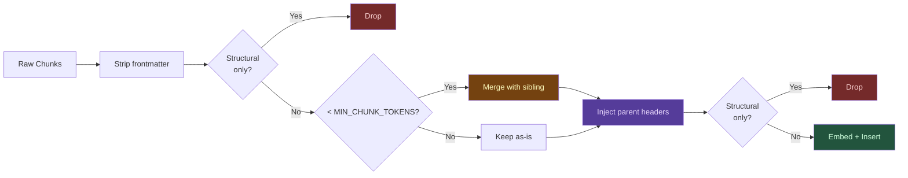

# Optimization Techniques

Performance optimizations implemented in markdown-fastrag-mcp.



## Smart Chunk Merging

MarkdownNodeParser often produces very small chunks (single-line headers, short paragraphs). These generate low-quality embeddings because there isn't enough semantic content.

**Solution:** Chunks below `MIN_CHUNK_TOKENS` (default 300) are merged with their next sibling:

```
Before merging:
  [Chunk 1: "## Setup" — 5 tokens]
  [Chunk 2: "Install with pip" — 8 tokens]
  [Chunk 3: "Configure your API key..." — 250 tokens]

After merging (threshold 300):
  [Chunk 1: "## Setup\nInstall with pip\nConfigure your API key..." — 263 tokens]
```

### Parent Header Injection

After merging, the parent heading context is injected at the top of each chunk. This ensures chunks from deep document hierarchies retain their section context:

```
Original chunk content:
  "Run `docker compose up -d`"

After header injection:
  "# Server Setup > ## Docker > ### Starting\nRun `docker compose up -d`"
```

This significantly improves search relevance for chunks that lack standalone context.

### Tuning

| Variable           | Default | Effect                                                      |
| ------------------ | ------- | ----------------------------------------------------------- |
| `MIN_CHUNK_TOKENS` | `300`   | Higher = fewer, larger chunks; lower = more, smaller chunks |

Tested values:
- **200**: More chunks, slightly better precision for short queries
- **300** (default): Good balance of chunk quality and granularity
- **500**: Fewer chunks, better for long-form documents

## Empty Chunk Filtering

After frontmatter stripping (Phase 12), some chunks contain no actual prose — only YAML metadata, markdown headers, or horizontal rules. These produce low-quality embeddings and pollute search results.

**Solution:** `is_structural_only()` detects chunks where every non-blank line is a header (`#{1,6} `) or separator (`---`, `***`, `___`). These are dropped at two points in the indexing pipeline and also filtered at search time:

| Filter point                   | When     | Effect                                   |
| ------------------------------ | -------- | ---------------------------------------- |
| After `strip_frontmatter()`    | Indexing | Drops empty chunks before merge          |
| After `inject_header_prefix()` | Indexing | Catches edge cases from prefix injection |
| In `search()` results          | Runtime  | Filters stale vectors without reindexing |

The runtime filter also re-applies `strip_frontmatter()` to Milvus results, handling vectors indexed before Phase 15.

### Regex fix: trailing newline

The original `_FM_RE` regex required a trailing newline after the closing `---`. Chunks stored in Milvus without a trailing newline bypassed the runtime filter entirely. Fixed by making the trailing newline optional: `(?:\r?\n|$)`.

## Batch Insert with gRPC Size Limit

Milvus enforces a **64 MB gRPC message limit**. For large indexes (20K+ chunks with 768-dim vectors), a single bulk insert can exceed this limit.

**Solution:** Chunks are inserted in batches of `MILVUS_INSERT_BATCH` (default 5,000) rows:

```python
for i in range(0, len(nodes), MILVUS_INSERT_BATCH):
    batch = nodes[i:i + MILVUS_INSERT_BATCH]
    await asyncio.to_thread(vector_store.add, batch)
```

### Tuning

| Variable              | Default | Effect                                      |
| --------------------- | ------- | ------------------------------------------- |
| `MILVUS_INSERT_BATCH` | `5000`  | Rows per insert call. Lower = safer, slower |

## Concurrent Embedding Batches

The embedding API is the slowest part of indexing. To maximize throughput, multiple embedding batches run concurrently:

```python
semaphore = asyncio.Semaphore(EMBEDDING_CONCURRENT_BATCHES)  # default 2

async def embed_batch(texts):
    async with semaphore:
        return await provider.embed(texts)

results = await asyncio.gather(*[embed_batch(b) for b in batches])
```

### Tuning

| Variable                       | Default | Effect                                              |
| ------------------------------ | ------- | --------------------------------------------------- |
| `EMBEDDING_BATCH_SIZE`         | `250`   | Texts per API call                                  |
| `EMBEDDING_CONCURRENT_BATCHES` | `2`     | Parallel batches. Higher = faster but more 429 risk |
| `EMBEDDING_BATCH_DELAY_MS`     | `0`     | Delay between batches. Set >0 to avoid rate limits  |

## Search Dedup

Without dedup, a single large document with many chunks can dominate search results. Per-file dedup ensures diversity:

| `DEDUP_MAX_PER_FILE` | Behavior                                      |
| -------------------- | --------------------------------------------- |
| `1` (default)        | At most 1 result per file — maximum diversity |
| `2`                  | Up to 2 results per file                      |
| `0`                  | No dedup — pure relevance ranking             |

The server oversamples by `k × 5` from the vector store, then deduplicates and returns the top-k.

## Scoped Operations

### Scoped Search

`scope_path` limits search results to a subdirectory:

```json
{ "query": "authentication", "scope_path": "/docs/security/" }
```

### Scoped Pruning

When `MARKDOWN_WORKSPACE` is set, pruning operations are scoped to the workspace root. This prevents a subdirectory reindex from wiping vectors belonging to other directories.

## Shell Reindex CLI

For large-scale operations, the shell CLI avoids MCP timeout limits:

```bash
# Incremental (default)
uv run python reindex.py /path/to/vault

# Full rebuild
uv run python reindex.py /path/to/vault --force

# Custom settings
EMBEDDING_PROVIDER=vertex \
MILVUS_ADDRESS=http://localhost:19530 \
EMBEDDING_BATCH_SIZE=100 \
uv run python reindex.py /path/to/vault --force
```

| Scenario                   | Use MCP `index_documents` | Use CLI `reindex.py` |
| -------------------------- | :-----------------------: | :------------------: |
| Incremental update         |             ✅             |                      |
| Keep agent responsive      |             ✅             |                      |
| Full reindex (1000+ files) |                           |          ✅           |
| Debug 429 / gRPC errors    |                           | ✅ (real-time stderr) |
| Initial workspace setup    |                           |   ✅ (timeout-safe)   |
